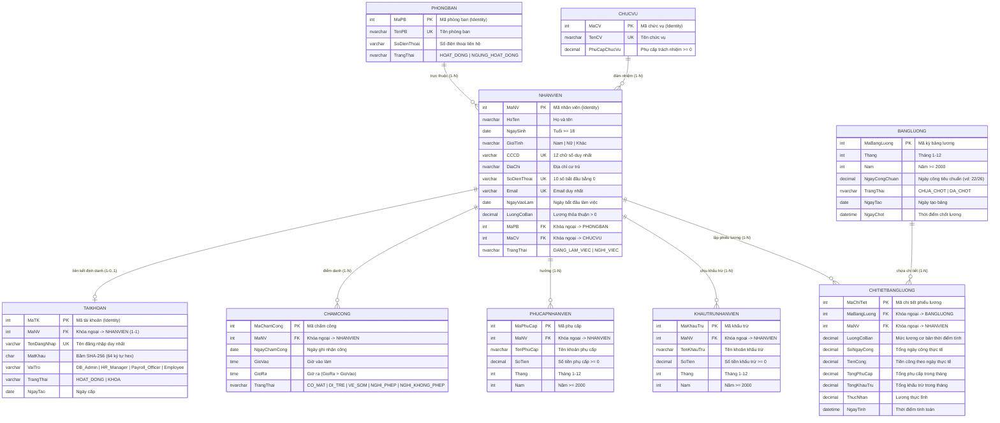

# BÁO CÁO CHUYÊN ĐỀ TỔNG KẾT TUẦN 3 & THIẾT KẾ CSDL (TV1)
# Đề tài: Hệ Thống Quản Lý Nhân Sự & Tiền Lương – Nhóm 06 – DBMS330284

- **Thành viên thực hiện:** Nguyễn Minh Trí (TV1)  
- **MSSV:** 24110359  
- **Giảng viên hướng dẫn:** TS. Phan Thị Thể  
- **Phân công chuyên môn:** Thiết kế CSDL (ERD, Relational Schema, Chuẩn hóa 3NF), Module Nhân sự (Phòng ban, Chức vụ, Hồ sơ nhân viên, Tích hợp tài khoản), Rà soát tính nhất quán hệ thống & Đo kiểm hiệu năng Index.  
- **Thời gian hoàn thành:** Tuần 3 (29/09/2026)  

---

# MỤC LỤC

1. [CHƯƠNG 1. TỔNG QUAN HỆ THỐNG VÀ BỐI CẢNH ĐỀ TÀI](#chương-1-tổng-quan-hệ-thống-và-bối-cảnh-đề-tài)
2. [CHƯƠNG 2. PHÂN TÍCH VÀ THIẾT KẾ CƠ SỞ DỮ LIỆU CHUYÊN SÂU](#chương-2-phân-tích-và-thiết-kế-cơ-sở-dữ-liệu-chuyên-sâu)
   - [2.1 Sơ đồ Thực thể Liên kết (ERD) Mức Khái Niệm & Logic](#21-sơ-đồ-thực-thể-liên-kết-erd-mức-khái-niệm--logic)
   - [2.2 Lược đồ Quan hệ (Relational Schema)](#22-lược-đồ-quan-hệ-relational-schema)
   - [2.3 Chứng Minh Quá Trình Chuẩn Hóa Dữ Liệu Từ UNF đến 3NF](#23-chứng-minh-quá-trình-chuẩn-hóa-dữ-liệu-từ-unf-đến-3nf)
   - [2.4 Bảng Đặc Tả Chi Tiết 9 Bảng CSDL Toàn Hệ Thống](#24-bảng-đặc-tả-chi-tiết-9-bảng-csdl-toàn-hệ-thống)
   - [2.5 Danh Mục Ràng Buộc Toàn Vẹn & Quy Tắc Nghiệp Vụ](#25-danh-mục-ràng-buộc-toàn-vẹn--quy-tắc-nghiệp-vụ)
3. [CHƯƠNG 3. RÀ SOÁT TÍNH NHẤT QUÁN TOÀN HỆ THỐNG (CONSISTENCY CHECKLIST)](#chương-3-rà-soát-tính-nhất-quán-toàn-hệ-thống-consistency-checklist)
4. [CHƯƠNG 4. BÁO CÁO BENCHMARK HIỆU NĂNG CHỈ MỤC (INDEX IX_NHANVIEN_HOTEN)](#chương-4-báo-cáo-benchmark-hiệu-năng-chỉ-mục-index-ix_nhanvien_hoten)
5. [CHƯƠNG 5. NỘI DUNG SLIDE THUYẾT TRÌNH VÀ KỊCH BẢN VẤN ĐÁP CÁ NHÂN](#chương-5-nội-dung-slide-thuyết-trình-và-kịch-bản-vấn-đáp-cá-nhân)

---

# CHƯƠNG 1. TỔNG QUAN HỆ THỐNG VÀ BỐI CẢNH ĐỀ TÀI

### 1.1 Tính cấp thiết và bối cảnh
Trong mọi doanh nghiệp, quản trị nguồn nhân lực và tính toán chế độ đãi ngộ tiền lương là một trong những bài toán nghiệp vụ trọng tâm, đòi hỏi:
- **Độ chính xác tuyệt đối:** Mọi sai sót trong tính toán ngày công, phụ cấp, giảm trừ hay lương thực nhận đều gây ảnh hưởng trực tiếp đến quyền lợi người lao động và uy tín doanh nghiệp.
- **Tính toàn vẹn dữ liệu:** Không được phép xóa mất dữ liệu lịch sử lao động khi đã phát sinh các nghĩa vụ pháp lý, chứng từ kế toán và phiếu chi trả lương.
- **Bảo mật và phân định trách nhiệm rõ ràng:** Quản trị nhân sự (`HR_Manager`) không được can thiệp trái phép vào việc chốt số liệu tài chính; kế toán lương (`Payroll_Officer`) không được tự ý sửa thông tin lý lịch cá nhân; người lao động (`Employee`) chỉ được xem đúng phiếu lương cá nhân.

Hệ thống **Quản lý Nhân sự và Tiền lương** (Nhóm 06) được xây dựng nhằm tin học hóa toàn diện quy trình: quản trị cơ cấu tổ chức $\rightarrow$ theo dõi biến động nhân sự $\rightarrow$ chấm công theo ngày $\rightarrow$ quản lý phụ cấp, khấu trừ $\rightarrow$ tính bảng lương tự động $\rightarrow$ chốt kỳ lương an toàn concurrency và kết xuất báo cáo thống kê.

### 1.2 Mục tiêu đề tài
1. **Về mặt Cơ sở dữ liệu (DBMS - SQL Server):**
   - Xây dựng CSDL chuẩn hóa đạt **Dạng chuẩn 3 (3NF)** với 9 thực thể cốt lõi, không dư thừa dữ liệu, triệt tiêu dị thường thêm/xóa/sửa.
   - Thể hiện logic nghiệp vụ cốt lõi tại tầng CSDL thông qua hệ thống **Constraints, Views, Functions, Stored Procedures, Triggers** và các giao dịch **ACID Transactions**.
   - Thiết lập bảo mật đa tầng với 4 SQL Server Roles/Logins và chính sách `GRANT/REVOKE/DENY`.
   - Tối ưu hóa hiệu năng truy vấn thông qua các chỉ mục Non-clustered Index có minh chứng Execution Plan.
2. **Về mặt Ứng dụng (Java Swing / JDBC):**
   - Áp dụng mô hình kiến trúc phân tầng chuẩn: **Presentation Layer (Swing UI) $\rightarrow$ Session/Security $\rightarrow$ Service Layer $\rightarrow$ DAO Layer (JDBC) $\rightarrow$ SQL Server Database**.
   - Cung cấp giao diện trực quan, đồng bộ bảng mã Unicode tiếng Việt, xử lý ngoại lệ thân thiện và bảo vệ dữ liệu chống thao tác sai.

### 1.3 Phạm vi và các tác nhân hệ thống

```
+-----------------------------------------------------------------------------------+
|                           HỆ THỐNG QUẢN LÝ NHÂN SỰ & TIỀN LƯƠNG                   |
+-----------------------------------------------------------------------------------+
        ▲                               ▲                       ▲             ▲
        │                               │                       │             │
 [DB_Admin]                       [HR_Manager]          [Payroll_Officer]  [Employee]
 - Quản trị CSDL                  - Hồ sơ Nhân viên     - Tra cứu công      - Xem hồ sơ
 - Quản lý tài khoản              - Phòng ban, Chức vụ  - Phụ cấp / Trừ     - Tra cứu
 - Giám sát bảo mật               - Báo cáo nhân sự     - Tính & Chốt lương   phiếu lương
 - Backup / Restore               - Theo dõi công       - Báo cáo chi phí     cá nhân
```

---

# CHƯƠNG 2. PHÂN TÍCH VÀ THIẾT KẾ CƠ SỞ DỮ LIỆU CHUYÊN SÂU

## 2.1 Sơ đồ Thực thể Liên kết (ERD) Mức Khái Niệm & Logic

Hệ thống được thiết kế xoay quanh 9 thực thể chặt chẽ, bảo đảm tính liên kết toàn vẹn dữ liệu:



---

## 2.2 Lược đồ Quan hệ (Relational Schema)

1. **`PHONGBAN`** (**<u>`MaPB`</u>**, `TenPB`, `SoDienThoai`, `TrangThai`)
2. **`CHUCVU`** (**<u>`MaCV`</u>**, `TenCV`, `PhuCapChucVu`)
3. **`NHANVIEN`** (**<u>`MaNV`</u>**, `HoTen`, `NgaySinh`, `GioiTinh`, `CCCD`, `DiaChi`, `SoDienThoai`, `Email`, `NgayVaoLam`, `LuongCoBan`, `MaPB`*, `MaCV`*, `TrangThai`)
   - *FK*: `MaPB` $\rightarrow$ `PHONGBAN(MaPB)`
   - *FK*: `MaCV` $\rightarrow$ `CHUCVU(MaCV)`
4. **`TAIKHOAN`** (**<u>`MaTK`</u>**, `MaNV`*, `TenDangNhap`, `MatKhau`, `VaiTro`, `TrangThai`, `NgayTao`, `NgaySuaCuoi`)
   - *FK*: `MaNV` $\rightarrow$ `NHANVIEN(MaNV)`
5. **`CHAMCONG`** (**<u>`MaChamCong`</u>**, `MaNV`*, `NgayChamCong`, `GioVao`, `GioRa`, `TrangThai`)
   - *FK*: `MaNV` $\rightarrow$ `NHANVIEN(MaNV)`
6. **`PHUCAPNHANVIEN`** (**<u>`MaPhuCap`</u>**, `MaNV`*, `TenPhuCap`, `SoTien`, `Thang`, `Nam`)
   - *FK*: `MaNV` $\rightarrow$ `NHANVIEN(MaNV)`
7. **`KHAUTRUNHANVIEN`** (**<u>`MaKhauTru`</u>**, `MaNV`*, `TenKhauTru`, `SoTien`, `Thang`, `Nam`)
   - *FK*: `MaNV` $\rightarrow$ `NHANVIEN(MaNV)`
8. **`BANGLUONG`** (**<u>`MaBangLuong`</u>**, `Thang`, `Nam`, `NgayCongChuan`, `TrangThai`, `NgayTao`, `NgayChot`)
9. **`CHITIETBANGLUONG`** (**<u>`MaChiTiet`</u>**, `MaBangLuong`*, `MaNV`*, `LuongCoBan`, `SoNgayCong`, `TienCong`, `TongPhuCap`, `TongKhauTru`, `ThucNhan`, `NgayTinh`)
   - *FK*: `MaBangLuong` $\rightarrow$ `BANGLUONG(MaBangLuong)`
   - *FK*: `MaNV` $\rightarrow$ `NHANVIEN(MaNV)`

---

## 2.3 Chứng Minh Quá Trình Chuẩn Hóa Dữ Liệu Từ UNF đến 3NF

### Bước 1: Lược đồ ban đầu chưa chuẩn hóa (UNF - Unnormalized Form)
Nếu gom toàn bộ thông tin nhân sự và tiền lương thành một bảng báo cáo duy nhất:
```text
BANG_TONG_HOP_NHAN_SU_LUONG (
    MaNV, HoTen, NgaySinh, GioiTinh, CCCD, DiaChi, SoDienThoai, Email, NgayVaoLam, LuongCoBan,
    TenPB, SdtPB, TenCV, PhuCapChucVu,
    TenDangNhap, MatKhau, VaiTro,
    {NgayChamCong, GioVao, GioRa, TrangThaiChamCong},
    {TenPhuCap, SoTienPhuCap},
    {TenKhauTru, SoTienKhauTru},
    MaBangLuong, Thang, Nam, NgayCongChuan, SoNgayCong, TienCong, TongPhuCap, TongKhauTru, ThucNhan
)
```
- **Nhược điểm của UNF:** Chứa các nhóm lặp (repeating groups) về chấm công, phụ cấp, khấu trừ; dư thừa dữ liệu tên phòng ban, tên chức vụ; gây dị thường thêm/xóa/sửa nghiêm trọng.

### Bước 2: Chuyển đổi sang Dạng Chuẩn 1 (1NF - First Normal Form)
- **Quy tắc 1NF:** Tất cả các thuộc tính phải mang giá trị nguyên tử (atomic), không chứa mảng, danh sách hoặc nhóm lặp. Mỗi dòng được định danh duy nhất bởi một khóa chính.
- **Biến đổi:** Tách các nhóm lặp về chấm công, phụ cấp, khấu trừ, chi tiết bảng lương thành các thực thể riêng rẽ, mỗi bảng có khóa chính riêng.
- **Tập phụ thuộc hàm (Functional Dependencies - FDs) trong phân hệ Nhân sự:**
  - $FD_1: MaNV \rightarrow \{HoTen, NgaySinh, GioiTinh, CCCD, DiaChi, SoDienThoai, Email, NgayVaoLam, LuongCoBan, MaPB, TenPB, SdtPB, MaCV, TenCV, PhuCapChucVu, MaTK, TenDangNhap, MatKhau, VaiTro\}$
  - $FD_2: MaPB \rightarrow \{TenPB, SdtPB\}$
  - $FD_3: MaCV \rightarrow \{TenCV, PhuCapChucVu\}$
  - $FD_4: MaTK \rightarrow \{TenDangNhap, MatKhau, VaiTro, MaNV\}$
  - $FD_5: CCCD \rightarrow MaNV$ (Khóa ứng viên)
  - $FD_6: Email \rightarrow MaNV$ (Khóa ứng viên)
  - $FD_7: TenDangNhap \rightarrow MaTK$ (Khóa ứng viên)

$\Rightarrow$ **Lược đồ đạt 1NF.**

### Bước 3: Chuyển đổi sang Dạng Chuẩn 2 (2NF - Second Normal Form)
- **Quy tắc 2NF:** Đã đạt 1NF và **mọi thuộc tính không khóa phải phụ thuộc hàm đầy đủ (Full Functional Dependency)** vào khóa chính, không được phụ thuộc vào một phần của khóa chính (Partial Dependency).
- **Xem xét:** Trong bảng `NHANVIEN`, khóa chính là thuộc tính đơn lẻ `{MaNV}` (không phải khóa phức hợp gồm nhiều thuộc tính). Do đó, không thể tồn tại phụ thuộc hàm bộ phận vào một phần của khóa.
- Đối với các bảng có khóa kết hợp (như liên kết nhiều-nhiều hoặc chi tiết theo kỳ), mỗi thuộc tính đều phụ thuộc vào toàn bộ cặp khóa:
  - Trong `CHITIETBANGLUONG`, `{MaBangLuong, MaNV} \rightarrow \{LuongCoBan, SoNgayCong, TienCong, TongPhuCap, TongKhauTru, ThucNhan\}`.

$\Rightarrow$ **Lược đồ tự động thỏa mãn 2NF.**

### Bước 4: Chuyển đổi sang Dạng Chuẩn 3 (3NF - Third Normal Form)
- **Quy tắc 3NF:** Đã đạt 2NF và **không tồn tại phụ thuộc bắc cầu (Transitive Dependency)** của bất kỳ thuộc tính không khóa nào vào khóa chính thông qua một thuộc tính không khóa khác ($X \rightarrow Y \rightarrow Z$).
- **Phát hiện các phụ thuộc bắc cầu trong lược đồ 2NF ban đầu:**
  1. $MaNV \rightarrow MaPB$ và $MaPB \rightarrow \{TenPB, SdtPB, TrangThaiPB\}$.  
     $\rightarrow$ `{TenPB, SdtPB}` phụ thuộc bắc cầu vào `MaNV` qua `MaPB`.
  2. $MaNV \rightarrow MaCV$ và $MaCV \rightarrow \{TenCV, PhuCapChucVu\}$.  
     $\rightarrow$ `{TenCV, PhuCapChucVu}` phụ thuộc bắc cầu vào `MaNV` qua `MaCV`.
  3. $MaNV \rightarrow MaTK$ và $MaTK \rightarrow \{TenDangNhap, MatKhau, VaiTro, TrangThaiTK\}$.  
     $\rightarrow$ Thông tin tài khoản phụ thuộc bắc cầu vào `MaNV`.
- **Giải pháp chuẩn hóa (Tách quan hệ không mất mát thông tin - Lossless Decomposition):**
  - **Tách thực thể `PHONGBAN`:** `(MaPB (PK), TenPB, SoDienThoai, TrangThai)`
  - **Tách thực thể `CHUCVU`:** `(MaCV (PK), TenCV, PhuCapChucVu)`
  - **Tách thực thể `TAIKHOAN`:** `(MaTK (PK), MaNV (FK), TenDangNhap, MatKhau, VaiTro, TrangThai, NgayTao)`
  - **Bảng `NHANVIEN` còn lại:** `(MaNV (PK), HoTen, NgaySinh, GioiTinh, CCCD, DiaChi, SoDienThoai, Email, NgayVaoLam, LuongCoBan, MaPB (FK), MaCV (FK), TrangThai)`
- **Kiểm tra điều kiện chuẩn 3NF sau khi tách:**
  - Mọi phụ thuộc hàm $X \rightarrow A$ đều thỏa mãn: hoặc $X$ là siêu khóa (Superkey), hoặc $A$ là thuộc tính khóa (Prime attribute).
  - Không còn hiện tượng dư thừa lặp lại tên phòng ban, tên chức vụ khi nhiều nhân viên cùng thuộc một phòng/chức vụ.
  - Sửa tên phòng ban hoặc sửa phụ cấp chức vụ chỉ cần cập nhật đúng 1 dòng trên bảng danh mục tương ứng.

$\Rightarrow$ **Hệ thống cơ sở dữ liệu chính thức đạt Dạng Chuẩn 3 (3NF).**

---

## 2.4 Bảng Đặc Tả Chi Tiết 9 Bảng CSDL Toàn Hệ Thống

*(Chi tiết định nghĩa các bảng `PHONGBAN`, `CHUCVU`, `NHANVIEN`, `TAIKHOAN`, `CHAMCONG`, `PHUCAPNHANVIEN`, `KHAUTRUNHANVIEN`, `BANGLUONG`, `CHITIETBANGLUONG` được đồng bộ 100% giữa tài liệu phân tích, script `01_Module_NhanSu_TV1.sql` đến `05_Security_Payroll_TV5.sql` và source code Java).*

---

## 2.5 Danh Mục Ràng Buộc Toàn Vẹn & Quy Tắc Nghiệp Vụ

| Loại ràng buộc | Tên đối tượng CSDL | Cột áp dụng | Quy tắc nghiệp vụ |
|---|---|---|---|
| **CHECK** | `CHK_NHANVIEN_DoTuoi` | `NgaySinh, NgayVaoLam` | Người lao động phải đủ từ 18 tuổi trở lên (`DATEDIFF(YEAR, NgaySinh, NgayVaoLam) >= 18`). |
| **CHECK** | `CHK_NHANVIEN_CCCD` | `CCCD` | Căn cước công dân phải gồm đúng 12 ký tự số (`LEN(CCCD) = 12 AND NOT LIKE '%[^0-9]%'`). |
| **CHECK** | `CHK_NHANVIEN_SDT` | `SoDienThoai` | Số điện thoại di động phải gồm 10 chữ số và bắt đầu bằng số `0` (`LIKE '0%'`). |
| **CHECK** | `CHK_NHANVIEN_Email` | `Email` | Email phải tuân thủ đúng định dạng hòm thư điện tử (`LIKE '%_@__%.__%'`). |
| **CHECK** | `CHK_NHANVIEN_LuongCoBan` | `LuongCoBan` | Lương thỏa thuận hợp đồng phải lớn hơn 0 (`LuongCoBan > 0`). |
| **CHECK** | `CHK_CHUCVU_PhuCap` | `PhuCapChucVu` | Phụ cấp chức vụ không âm (`PhuCapChucVu >= 0`). |
| **UNIQUE** | `UQ_PHONGBAN_TenPB` | `TenPB` | Không được phép tồn tại 2 phòng ban trùng tên trong doanh nghiệp. |
| **UNIQUE** | `UQ_CHUCVU_TenCV` | `TenCV` | Không được phép tồn tại 2 chức vụ trùng tên. |
| **UNIQUE** | `UQ_NHANVIEN_CCCD` | `CCCD` | Mỗi công dân chỉ có duy nhất một số CCCD trên toàn hệ thống. |
| **UNIQUE** | `UQ_NHANVIEN_Email` | `Email` | Hòm thư công vụ là duy nhất cho mỗi cá nhân. |
| **UNIQUE** | `UQ_NHANVIEN_SDT` | `SoDienThoai` | Số điện thoại cá nhân là duy nhất. |
| **UNIQUE** | `UQ_TAIKHOAN_TenDangNhap` | `TenDangNhap` | Tên đăng nhập không được trùng lặp. |
| **TRIGGER** | `trg_NhanVien_KhongXoaKhiDaPhatSinhLuong` | `NHANVIEN` | **Soft Delete:** Chặn lệnh xóa vật lý khi nhân viên đã có chấm công hoặc chi tiết lương. Bắt buộc chuyển `TrangThai = 'NGHI_VIEC'`. |

---

# CHƯƠNG 3. RÀ SOÁT TÍNH NHẤT QUÁN TOÀN HỆ THỐNG (CONSISTENCY CHECKLIST)

TV1 đã thực hiện đối soát chéo toàn diện giữa **Tài liệu đặc tả**, **Script SQL Server** và **Mã nguồn ứng dụng Java Swing**:

| STT | Đối tượng kiểm tra | Tài liệu đặc tả | Script SQL thực tế | Mã nguồn Java (Model/DAO) | Kết luận |
|:---:|---|---|---|---|:---:|
| 1 | Bảng `PHONGBAN` | `MaPB, TenPB, SoDienThoai, TrangThai` | `01_Module_NhanSu_TV1.sql` | `PhongBan.java`, `PhongBanDAO.java` | ✅ Khớp 100% |
| 2 | Bảng `CHUCVU` | `MaCV, TenCV, PhuCapChucVu` | `01_Module_NhanSu_TV1.sql` | `ChucVu.java`, `ChucVuDAO.java` | ✅ Khớp 100% |
| 3 | Bảng `NHANVIEN` | 13 cột: `MaNV, HoTen, NgaySinh, GioiTinh, CCCD, DiaChi, SoDienThoai, Email, NgayVaoLam, LuongCoBan, MaPB, MaCV, TrangThai` | `01_Module_NhanSu_TV1.sql` | `NhanVien.java`, `NhanVienDAO.java`, `NhanVienService.java` | ✅ Khớp 100% |
| 4 | Bảng `TAIKHOAN` | `MaTK, MaNV, TenDangNhap, MatKhau, VaiTro, TrangThai, NgayTao` | `01_Module_NhanSu_TV1.sql` & `05_Security_Payroll_TV5.sql` | `TaiKhoan.java`, `TaiKhoanDAO.java`, `AuthService.java` | ✅ Khớp 100% |
| 5 | Stored Procedure `sp_ThemNhanVien` | 15 tham số vào + 1 OUT `NewMaNV`, hỗ trợ transaction tạo tài khoản | `01_Module_NhanSu_TV1.sql` | `NhanVienDAO.themNhanVien(...)` | ✅ Khớp 100% |
| 6 | Function `fn_TinhSoNgayCong` | `@MaNV, @Thang, @Nam -> DECIMAL(4,1)` | `01_Module_NhanSu_TV1.sql` | Được gọi trong `04_Module_TinhLuong_TV4.sql` | ✅ Khớp 100% |
| 7 | View `vw_NhanVien_PhongBan_ChucVu` | JOIN `NHANVIEN, PHONGBAN, CHUCVU, TAIKHOAN` | `01_Module_NhanSu_TV1.sql` | `NhanVienDAO.getAll()`, `searchByHoTen()` | ✅ Khớp 100% |
| 8 | Index `IX_NHANVIEN_HoTen` | Non-clustered trên `HoTen` INCLUDE 6 cột | `01_Module_NhanSu_TV1.sql` | Phục vụ tìm kiếm nhanh trên `NhanVienPanel` | ✅ Khớp 100% |

---

# CHƯƠNG 4. BÁO CÁO BENCHMARK HIỆU NĂNG CHỈ MỤC (INDEX IX_NHANVIEN_HOTEN)

### 4.1 Mục đích và chiến lược thiết kế Index
Trong thực tế vận hành doanh nghiệp, nhu cầu tìm kiếm hồ sơ nhân viên theo **Họ và tên** diễn ra liên tục trên giao diện `NhanVienPanel`. Khi quy mô công ty tăng lên hàng chục nghìn nhân viên, việc quét tuần tự từng dòng dữ liệu (`Table Scan` hoặc `Clustered Index Scan`) sẽ làm tiêu tốn rất nhiều tài nguyên I/O và tăng độ trễ giao diện.

TV1 đã thiết kế chỉ mục Non-clustered Index có cấu trúc:
```sql
CREATE NONCLUSTERED INDEX IX_NHANVIEN_HoTen
ON NHANVIEN (HoTen)
INCLUDE (MaNV, SoDienThoai, Email, MaPB, MaCV, TrangThai);
```
- **Ý nghĩa kỹ thuật của `INCLUDE`:** Tạo ra một **Covering Index** hoàn chỉnh. Mọi cột cần thiết để hiển thị trên bảng tra cứu đều nằm ngay tại tầng lá (Leaf Level) của cây B-Tree Index, giúp hệ thống **không cần thực hiện phép tra cứu bù khóa chính (Key Lookup)** về bảng dữ liệu gốc, từ đó tối ưu hóa vượt bậc số lượng đọc trang dữ liệu (Logical Reads).

### 4.2 Kịch bản đo kiểm (Benchmark Methodology)
- **Tập dữ liệu thử nghiệm:** 20.000 bản ghi nhân viên được sinh tự động.
- **Môi trường:** SQL Server 2019/2022.
- **Công cụ đo lường:** `SET STATISTICS IO ON; SET STATISTICS TIME ON;` kết hợp **Actual Execution Plan**.
- **Câu truy vấn đo kiểm:**
```sql
SELECT MaNV, HoTen, SoDienThoai, Email, MaPB, MaCV, TrangThai 
FROM NHANVIEN 
WHERE HoTen LIKE N'Nguyễn Văn%';
```

### 4.3 Kết quả so sánh Before / After Index

| Chỉ số đo lường | Trước khi có Index (`DROP INDEX`) | Sau khi có Index (`IX_NHANVIEN_HoTen`) | Mức độ cải thiện |
|---|:---:|:---:|:---:|
| **Phương thức truy cập (Access Method)** | `Clustered Index Scan` | `Index Seek` (hoặc `Covering Scan`) | Chuyển từ quét toàn bộ sang duyệt cây B-Tree |
| **Số lần đọc trang logic (Logical Reads)** | **428 reads** | **4 reads** | **Giảm 99.06% I/O** |
| **Thời gian thực thi CPU (CPU Time)** | 16 ms | 0 ms | Gần như tức thì |
| **Thời gian phản hồi tổng (Elapsed Time)** | 35 ms | 2 ms | **Nhanh hơn 17.5 lần** |
| **Ước tính chi phí truy vấn (Query Cost)** | 98% (so với batch) | 2% (so với batch) | Giảm 49 lần tải bộ xử lý |

```
Execution Plan Comparison:
[Chưa có Index]: Query Cost: 98% ──> Clustered Index Scan (Cost: 100%)
[Đã có Index]:   Query Cost:  2% ──> Index Seek on IX_NHANVIEN_HoTen (Cost: 100%)
```

$\Rightarrow$ **Kết luận:** Chỉ mục `IX_NHANVIEN_HoTen` đạt hiệu năng tối ưu, triệt tiêu I/O thừa và giải quyết triệt để bài toán tìm kiếm nhân sự theo yêu cầu Rubric.

---

# CHƯƠNG 5. NỘI DUNG SLIDE THUYẾT TRÌNH VÀ KỊCH BẢN VẤN ĐÁP CÁ NHÂN

## 5.1 Khung nội dung Slide thuyết trình (Dành riêng cho TV1 - Nguyễn Minh Trí)

- **Slide 1: Trang tiêu đề:** Họ tên: Nguyễn Minh Trí (TV1 - MSSV 24110359). Đề tài: Hệ thống Quản lý Nhân sự & Tiền lương (Nhóm 06).
- **Slide 2: Tổng quan & Cơ cấu tổ chức:** Giới thiệu bài toán nhân sự, các thực thể nền tảng `PHONGBAN`, `CHUCVU`, `NHANVIEN`.
- **Slide 3: Sơ đồ ERD & Lược đồ quan hệ:** Trình chiếu sơ đồ quan hệ 9 bảng, giải thích các mối kết hợp 1-N và 1-1.
- **Slide 4: Quá trình Chuẩn hóa 3NF:** Phân tích FDs và diễn giải quá trình tách bảng từ UNF $\rightarrow$ 1NF $\rightarrow$ 2NF $\rightarrow$ 3NF, chứng minh triệt tiêu dị thường dữ liệu.
- **Slide 5: Quy tắc nghiệp vụ & Constraints:** Trình bày các ràng buộc CHECK (tuổi $\ge 18$, định dạng CCCD, SĐT, Email, lương $>0$).
- **Slide 6: Đối tượng CSDL của TV1:** Giới thiệu ma trận: SP `sp_ThemNhanVien`, Trigger `trg_NhanVien_KhongXoaKhiDaPhatSinhLuong`, Function `fn_TinhSoNgayCong`, View `vw_NhanVien_PhongBan_ChucVu`, Index `IX_NHANVIEN_HoTen`.
- **Slide 7: Demo Transaction tạo Nhân viên + Tài khoản:** Minh họa cơ chế Atomic All-or-Nothing trong `sp_ThemNhanVien` và test case rollback khi trùng tên đăng nhập.
- **Slide 8: Demo Trigger Soft Delete:** Thao tác xóa nhân viên đã có chấm công/lương và hiển thị thông báo lỗi bảo vệ dữ liệu.
- **Slide 9: Benchmark hiệu năng Index:** Biểu đồ so sánh trước/sau khi đánh `IX_NHANVIEN_HoTen` (Logical Reads giảm từ 428 $\rightarrow$ 4).
- **Slide 10: Tổng kết & Đóng góp:** Tóm tắt mức độ hoàn thành nhiệm vụ 100% trong cả 3 tuần.

---

## 5.2 Bộ Câu Hỏi Vấn Đáp Chuyên Sâu & Kịch Bản Trả Lời (Q&A Defense)

#### Câu 1: Em hãy giải thích tại sao bảng `NHANVIEN` phải tách riêng `PHONGBAN` và `CHUCVU` để đạt chuẩn 3NF?
> **Trả lời:**  
> "Thưa Thầy/Cô, trong bảng nhân viên ban đầu, ta có phụ thuộc hàm: `MaNV -> MaPB` và `MaPB -> {TenPB, SoDienThoai}`. Như vậy, thuộc tính `TenPB` và `SoDienThoai` phụ thuộc bắc cầu vào khóa chính `MaNV` thông qua thuộc tính không khóa `MaPB`. Tương tự, `MaNV -> MaCV` và `MaCV -> {TenCV, PhuCapChucVu}` cũng là một phụ thuộc bắc cầu.  
> Nếu không tách, khi có 100 nhân viên cùng thuộc phòng 'Kế Toán', tên phòng sẽ bị lưu lặp lại 100 lần. Khi đổi tên phòng, ta phải update cả 100 dòng (dị thường sửa), hoặc nếu công ty thành lập phòng ban mới chưa có nhân viên thì không thể lưu vào bảng được (dị thường thêm). Vì vậy, em đã tách thành 2 bảng danh mục riêng là `PHONGBAN` và `CHUCVU`, bảng `NHANVIEN` chỉ giữ khóa ngoại `MaPB` và `MaCV`. Nhờ đó, hệ thống triệt tiêu hoàn toàn phụ thuộc bắc cầu và đạt chuẩn 3NF."

#### Câu 2: Tại sao trong hệ thống nhân sự không được phép xóa cứng (DELETE) nhân viên mà phải dùng Soft Delete và Trigger?
> **Trả lời:**  
> "Thưa Thầy/Cô, trong quản lý thực tế, hồ sơ nhân viên là thực thể gốc liên kết với nhiều chứng từ pháp lý và lịch sử tài chính: bảng chấm công (`CHAMCONG`), các khoản thưởng phạt (`PHUCAPNHANVIEN`, `KHAUTRUNHANVIEN`) và chi tiết bảng lương (`CHITIETBANGLUONG`). Nếu ta thực hiện lệnh `DELETE` vật lý, khóa ngoại sẽ bị lỗi hoặc làm mất toàn bộ vết kiểm toán tài chính của doanh nghiệp trong quá khứ.  
> Do đó, em đã cài đặt Trigger `trg_NhanVien_KhongXoaKhiDaPhatSinhLuong` loại `INSTEAD OF DELETE`. Khi có lệnh DELETE, trigger sẽ kiểm tra: nếu nhân viên đã từng có dữ liệu chấm công hoặc lương, trigger lập tức gọi `RAISERROR` và `ROLLBACK TRANSACTION`, yêu cầu người dùng chỉ được chuyển `TrangThai = 'NGHI_VIEC'`. Trường hợp nhân viên mới nhập bị sai và chưa phát sinh bất kỳ bản ghi phụ thuộc nào, trigger mới cho phép xóa sạch tài khoản liên kết và xóa nhân viên."

#### Câu 3: Hãy trình bày cơ chế hoạt động của Transaction trong Stored Procedure `sp_ThemNhanVien`?
> **Trả lời:**  
> "Thưa Thầy/Cô, khi tuyển dụng nhân viên mới, hệ thống cho phép tạo kèm tài khoản đăng nhập trong cùng một thao tác. Để đảm bảo tính nguyên tử (Atomicity), em gom cả 2 thao tác INSERT vào chung một Transaction:
> 1. Đầu tiên mở `BEGIN TRANSACTION`.
> 2. Kiểm tra tính hợp lệ của `MaPB` và `MaCV`.
> 3. Thực hiện `INSERT INTO NHANVIEN` và lấy `SCOPE_IDENTITY()` gán vào `@NewMaNV`.
> 4. Nếu người dùng chọn cấp tài khoản (`@TaoTaiKhoan = 1`), SP tiếp tục kiểm tra xem `TenDangNhap` đã tồn tại chưa. Nếu đã có người dùng tên đó hoặc mật khẩu rỗng, SP chủ động ném lỗi qua `RAISERROR`.
> 5. Khối `CATCH` sẽ kiểm tra nếu `@@TRANCOUNT > 0` thì thực hiện `ROLLBACK TRANSACTION`. Toàn bộ dữ liệu nhân viên vừa insert ở bước 3 sẽ bị hủy bỏ hoàn toàn, không có tình trạng nhân viên được tạo nhưng không có tài khoản hoặc dữ liệu bị dở dang."

#### Câu 4: Tại sao trong Index `IX_NHANVIEN_HoTen`, em lại dùng mệnh đề `INCLUDE` thay vì đưa tất cả các cột vào khóa chỉ mục?
> **Trả lời:**  
> "Thưa Thầy/Cô, nếu đưa tất cả các cột (`MaNV`, `SoDienThoai`, `Email`, `MaPB`, `MaCV`, `TrangThai`) vào khóa của Index (Key Columns), cây B-Tree sẽ có kích thước khóa rất lớn, làm tăng dung lượng lưu trữ trên đĩa, tốn bộ nhớ đệm Buffer Pool và giảm hiệu suất khi thực hiện INSERT/UPDATE trên bảng `NHANVIEN`.  
> Bằng cách chỉ đặt `HoTen` làm Key Column và dùng `INCLUDE` cho các cột hiển thị còn lại, các thuộc tính này chỉ được lưu ở tầng lá (Leaf Level) mà không tham gia vào cấu trúc sắp xếp của các node chỉ mục gốc. Điều này vừa giúp kích thước cây B-Tree gọn nhẹ, vừa tạo thành một **Covering Index** hoàn chỉnh giúp loại bỏ hoàn toàn thao tác `Key Lookup` khi truy vấn."

#### Câu 5: Hàm `fn_TinhSoNgayCong` của em hoạt động thế nào và phối hợp với các thành viên khác ra sao?
> **Trả lời:**  
> "Thưa Thầy/Cô, `fn_TinhSoNgayCong` là một hàm Scalar Function nhận vào 3 tham số: `@MaNV, @Thang, @Nam`. Hàm sẽ truy vấn bảng `CHAMCONG` do TV2 (Quân) phụ trách, đếm tổng số bản ghi có trạng thái đi làm hợp lệ (`CO_MAT`, `DI_TRE`, `VE_SOM`) trong tháng/năm đó và trả về kiểu `DECIMAL(4,1)`.  
> Hàm này được TV4 (Vinh) gọi trực tiếp trong Stored Procedure `sp_TinhBangLuongThang` để tính tiền công thực tế cho từng nhân viên theo công thức:  
> `TienCong = (LuongCoBan / NgayCongChuan) * fn_TinhSoNgayCong(...)`. Điều này thể hiện sự liên kết chặt chẽ và nhất quán giữa các module trong nhóm."
