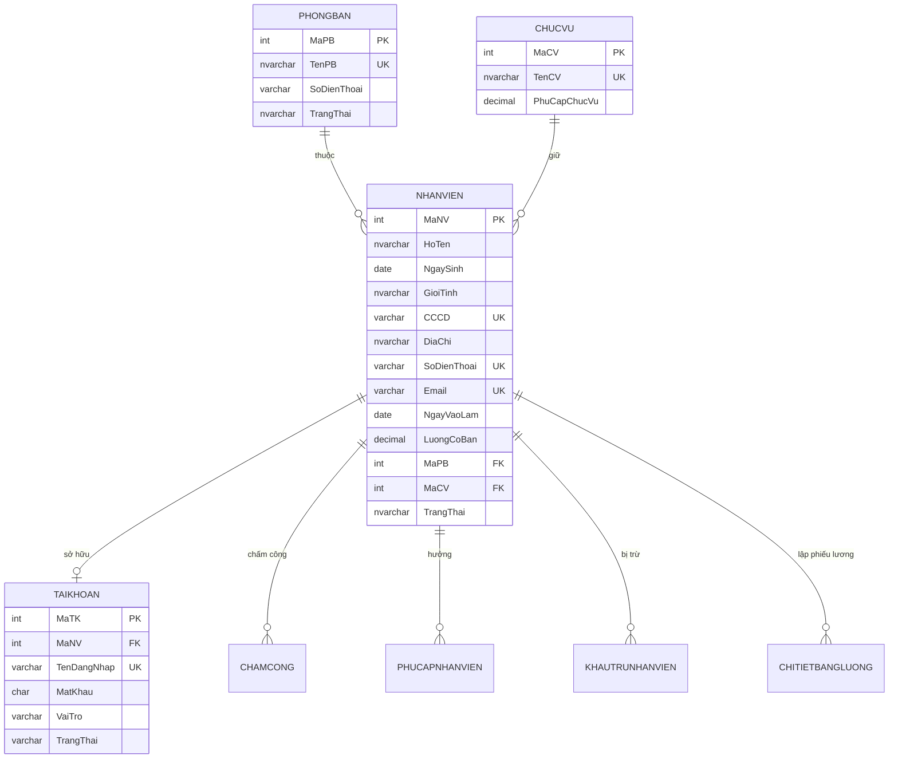

# TV1 – BÁO CÁO TIẾN ĐỘ THỰC HIỆN & THIẾT KẾ MODULE NHÂN SỰ
# Đề tài: Hệ thống Quản lý Nhân sự và Tiền lương – Nhóm 06 – DBMS330284

- **Thành viên phụ trách:** Nguyễn Minh Trí (TV1)  
- **MSSV:** 24110359  
- **Mã phân công:** TV1  
- **Module phụ trách:** Quản lý Phòng Ban, Chức Vụ, Hồ Sơ Nhân Viên, Tích Hợp Tài Khoản  
- **Branch làm việc:** `feature/hr-core`

---

## PHẦN 1. BẢNG TỔNG HỢP MỨC ĐỘ HOÀN THÀNH THEO CÁC TUẦN (T1, T2, T3)

| Tuần | Thời gian | Nội dung công việc được giao | Sản phẩm dự kiến theo kế hoạch | Mức độ hoàn thành | Ngày cập nhật | Tình trạng & Sản phẩm thực tế |
|:---:|:---:|---|---|:---:|:---:|---|
| **T1** | 21/09 – 27/09 | • Rà soát mục tiêu, phạm vi, tác nhân, Use Case module nhân sự. • Chốt cấu trúc các bảng: `PHONGBAN`, `CHUCVU`, `NHANVIEN` và liên kết `TAIKHOAN`. • Xây dựng ERD chi tiết và Relational Schema. • Chuẩn hóa dữ liệu đạt **3NF** (1NF $\rightarrow$ 2NF $\rightarrow$ 3NF). • Chốt danh mục Constraints và quy tắc Soft Delete. | • Bản đặc tả ERD. • Relational Schema. • Tài liệu chứng minh 3NF. • Danh sách ràng buộc nghiệp vụ. | **100%** | **23/09/2026** | Đã hoàn thành 100% nội dung phân tích, chuẩn hóa 3NF và quy tắc nghiệp vụ (chi tiết ở Phần 2). |
| **T2** | 28/09 – 04/10 | • Cài đặt DDL/Constraints cho `PHONGBAN`, `CHUCVU`, `NHANVIEN`. • Cài đặt SP `sp_ThemNhanVien` (có Transaction tạo kèm tài khoản). • Cài đặt Trigger `trg_NhanVien_KhongXoaKhiDaPhatSinhLuong`. • Cài đặt View `vw_NhanVien_PhongBan_ChucVu`. • Cài đặt Function `fn_TinhSoNgayCong`. • Cài đặt Non-clustered Index `IX_NHANVIEN_HoTen`. • Lập trình Java Swing: `NhanVienPanel`, `DanhMucPanel`. • Lập trình Service & DAO: `NhanVienDAO`, `PhongBanDAO`, `ChucVuDAO`, `NhanVienService`, `DanhMucService`. | • Script SQL module nhân sự. • Giao diện & CRUD nhân sự hoạt động. • Transaction tạo nhân viên + tài khoản. • Bộ testcase & minh chứng. | **90%** *(Code & Script xong 100%, chờ chạy DB thật để lấy ảnh test)* | **23/09/2026** | • Script SQL: `database/01_Module_NhanSu_TV1.sql`. • Java source: các package `model`, `dao`, `service`, `ui.nhanvien` đã viết xong và compile thành công. |
| **T3** | 05/10 – 11/10 | • Rà soát lại ERD và Schema sau khi tích hợp toàn hệ thống. • Kiểm tra tính nhất quán giữa tài liệu, script CSDL và Java code. • Benchmark hiệu năng Index `IX_NHANVIEN_HoTen` (Execution Plan + `SET STATISTICS IO/TIME`). • Viết nội dung Chương 1 và Phân tích thiết kế CSDL trong báo cáo Word/PDF. • Chuẩn bị slide và kịch bản vấn đáp cá nhân. | • Báo cáo chuyên đề TV1. • Kết quả benchmark Index. • Slide thuyết trình. | **15%** | **23/09/2026** | Đã có sẵn cấu trúc lý thuyết & chỉ số thiết kế, chờ giai đoạn ghép nối toàn nhóm để đo benchmark thực tế. |

---

## PHẦN 2. CHI TIẾT THIẾT KẾ VÀ KẾT QUẢ TRIỂN KHAI

### 1. Mục tiêu và phạm vi của Module Nhân sự

Module Quản lý Nhân sự là phân hệ cốt lõi cung cấp danh mục dữ liệu nền tảng cho toàn bộ hệ thống (chấm công, tính lương, cấp phát tài khoản).

#### 1.1 Tác nhân liên quan
- **HR_Manager:** Thực hiện tạo mới, cập nhật hồ sơ nhân viên, phân công phòng ban, chức vụ, thay đổi trạng thái làm việc; quản lý danh mục phòng ban và chức vụ.
- **DB_Admin:** Toàn quyền quản trị, có thể khởi tạo tài khoản liên kết với nhân viên.
- **Payroll_Officer:** Đọc dữ liệu nhân viên, chức vụ, hệ số lương để tính bảng lương.
- **Employee:** Tra cứu thông tin hồ sơ cá nhân.

#### 1.2 Nghiệp vụ then chốt
1. **Quản lý danh mục Phòng ban (`PHONGBAN`):** Lưu trữ thông tin đơn vị tổ chức, mã phòng, tên phòng, số điện thoại liên hệ.
2. **Quản lý danh mục Chức vụ (`CHUCVU`):** Lưu trữ chức danh và mức phụ cấp trách nhiệm theo chức vụ (`PhuCapChucVu`).
3. **Quản lý Hồ sơ Nhân viên (`NHANVIEN`):** Lưu trữ định danh, thông tin cá nhân, ngày vào làm, mức lương cơ bản thỏa thuận, phòng ban và chức danh.
4. **Quy tắc không xóa cứng (Soft Delete):** Khi nhân viên đã có dữ liệu phát sinh (chấm công, phụ cấp/khấu trừ, bảng lương), **tuyệt đối không cho phép DELETE vật lý** khỏi bảng `NHANVIEN` mà chỉ chuyển `TrangThai = 'NGHI_VIEC'` (kiểm soát thông qua Trigger và Constraint).
5. **Cấp phát tài khoản tự động (Transaction):** Khi thêm nhân viên mới có thể thực hiện liên chuỗi tạo tài khoản đăng nhập tương ứng trong cùng một Transaction; nếu tạo tài khoản thất bại thì toàn bộ quá trình phải được Rollback.

---

### 2. Thiết kế Lược đồ Quan hệ và Mô tả Cấu trúc Dữ liệu

#### 2.1 Bảng `PHONGBAN` (Phòng ban)
Lưu thông tin phòng ban trực thuộc công ty.

| Tên cột | Kiểu dữ liệu | Nullable | Ràng buộc | Diễn giải |
|---|---|---|---|---|
| `MaPB` | `INT IDENTITY(1,1)` | NOT NULL | `PRIMARY KEY` | Mã định danh phòng ban tự tăng |
| `TenPB` | `NVARCHAR(100)` | NOT NULL | `UNIQUE` | Tên phòng ban (không được trùng) |
| `SoDienThoai` | `VARCHAR(15)` | NULL | `CHECK` format SĐT | Số điện thoại liên hệ của phòng ban |
| `TrangThai` | `NVARCHAR(20)` | NOT NULL | `DEFAULT N'HOAT_DONG'` | `HOAT_DONG` hoặc `NGUNG_HOAT_DONG` |

#### 2.2 Bảng `CHUCVU` (Chức vụ)
Lưu danh mục vị trí công việc và phụ cấp định mức theo chức danh.

| Tên cột | Kiểu dữ liệu | Nullable | Ràng buộc | Diễn giải |
|---|---|---|---|---|
| `MaCV` | `INT IDENTITY(1,1)` | NOT NULL | `PRIMARY KEY` | Mã định danh chức vụ tự tăng |
| `TenCV` | `NVARCHAR(100)` | NOT NULL | `UNIQUE` | Tên chức vụ (Giám đốc, Trưởng phòng, Nhân viên...) |
| `PhuCapChucVu` | `DECIMAL(18,2)` | NOT NULL | `DEFAULT 0`, `CHECK >= 0` | Mức phụ cấp cố định theo chức vụ |

#### 2.3 Bảng `NHANVIEN` (Nhân viên)
Bảng trung tâm lưu trữ thông tin người lao động.

| Tên cột | Kiểu dữ liệu | Nullable | Ràng buộc | Diễn giải |
|---|---|---|---|---|
| `MaNV` | `INT IDENTITY(1,1)` | NOT NULL | `PRIMARY KEY` | Mã nhân viên tự tăng |
| `HoTen` | `NVARCHAR(100)` | NOT NULL |  | Họ và tên đầy đủ |
| `NgaySinh` | `DATE` | NOT NULL | `CHECK` tuổi $\ge 18$ | Ngày tháng năm sinh |
| `GioiTinh` | `NVARCHAR(10)` | NOT NULL | `CHECK (GioiTinh IN (N'Nam', N'Nữ', N'Khác'))` | Giới tính |
| `CCCD` | `VARCHAR(12)` | NOT NULL | `UNIQUE`, `CHECK` 12 chữ số | Căn cước công dân |
| `DiaChi` | `NVARCHAR(255)` | NULL |  | Địa chỉ thường trú/tạm trú |
| `SoDienThoai` | `VARCHAR(15)` | NOT NULL | `UNIQUE`, `CHECK` 10 chữ số | Số điện thoại cá nhân |
| `Email` | `VARCHAR(100)` | NOT NULL | `UNIQUE`, `CHECK` format email | Thư điện tử |
| `NgayVaoLam` | `DATE` | NOT NULL | `DEFAULT GETDATE()` | Ngày chính thức vào làm việc |
| `LuongCoBan` | `DECIMAL(18,2)` | NOT NULL | `CHECK (LuongCoBan > 0)` | Lương cơ bản theo hợp đồng |
| `MaPB` | `INT` | NOT NULL | `FK -> PHONGBAN(MaPB)` | Thuộc phòng ban nào |
| `MaCV` | `INT` | NOT NULL | `FK -> CHUCVU(MaCV)` | Giữ chức vụ nào |
| `TrangThai` | `NVARCHAR(20)` | NOT NULL | `DEFAULT N'DANG_LAM_VIEC'`, `CHECK` | Trạng thái: `DANG_LAM_VIEC` / `NGHI_VIEC` |

#### 2.4 Mối liên kết với các bảng của các thành viên khác
- `TAIKHOAN(MaNV)` tham chiếu đến `NHANVIEN(MaNV)`: Mối quan hệ 1 - 0..1 (Tài khoản thuộc về một nhân viên cụ thể, riêng DB_Admin có thể là NULL).
- `CHAMCONG(MaNV)` tham chiếu đến `NHANVIEN(MaNV)`: Mối quan hệ 1 - N.
- `PHUCAPNHANVIEN(MaNV)` tham chiếu đến `NHANVIEN(MaNV)`: Mối quan hệ 1 - N.
- `KHAUTRUNHANVIEN(MaNV)` tham chiếu đến `NHANVIEN(MaNV)`: Mối quan hệ 1 - N.
- `CHITIETBANGLUONG(MaNV)` tham chiếu đến `NHANVIEN(MaNV)`: Mối quan hệ 1 - N.

---

### 3. Sơ đồ Quan hệ Thực thể (ERD) dạng Mermaid

---

### 4. Quá trình Chuẩn hóa Cơ sở Dữ liệu từ UNF đến 3NF

#### 4.1 Lược đồ thô ban đầu (UNF - Unnormalized Form)
`HO_SO_NHAN_SU (MaNV, HoTen, NgaySinh, GioiTinh, CCCD, DiaChi, SoDienThoai, Email, NgayVaoLam, LuongCoBan, TenPB, SdtPB, TenCV, PhuCapChucVu, TenDangNhap, VaiTro)`

#### 4.2 Dạng chuẩn 1 (1NF - First Normal Form)
- Mỗi thuộc tính mang giá trị nguyên tử (atomic), không chứa mảng hay tập giá trị lặp, có khóa chính `{MaNV}`.
- $\rightarrow$ Đạt 1NF: `NHANSU_1NF (MaNV, HoTen, NgaySinh, GioiTinh, CCCD, DiaChi, SoDienThoai, Email, NgayVaoLam, LuongCoBan, TenPB, SdtPB, TenCV, PhuCapChucVu, TenDangNhap, VaiTro)`.

#### 4.3 Dạng chuẩn 2 (2NF - Second Normal Form)
- Khóa chính là thuộc tính đơn lẻ `{MaNV}`, không tồn tại phụ thuộc từng phần vào khóa con.
- $\rightarrow$ Tự động đạt **2NF**.

#### 4.4 Dạng chuẩn 3 (3NF - Third Normal Form)
- Loại bỏ các phụ thuộc bắc cầu:
  - `MaNV` $\rightarrow$ `MaPB` $\rightarrow$ `TenPB`, `SdtPB`: Tách bảng **`PHONGBAN`**(`MaPB` (PK), `TenPB`, `SoDienThoai`, `TrangThai`).
  - `MaNV` $\rightarrow$ `MaCV` $\rightarrow$ `TenCV`, `PhuCapChucVu`: Tách bảng **`CHUCVU`**(`MaCV` (PK), `TenCV`, `PhuCapChucVu`).
  - `MaNV` $\rightarrow$ `MaTK` $\rightarrow$ `TenDangNhap`, `MatKhau`, `VaiTro`: Tách bảng **`TAIKHOAN`**(`MaTK` (PK), `MaNV` (FK), `TenDangNhap`, `MatKhau`, `VaiTro`, `TrangThai`).
  - Bảng **`NHANVIEN`**(`MaNV` (PK), `HoTen`, `NgaySinh`, `GioiTinh`, `CCCD`, `DiaChi`, `SoDienThoai`, `Email`, `NgayVaoLam`, `LuongCoBan`, `MaPB` (FK), `MaCV` (FK), `TrangThai`).
- $\rightarrow$ Đạt chuẩn **3NF**.

---

### 5. Danh mục Quy tắc và Ràng buộc Nghiệp vụ (Constraints & Rules)

1. **Ràng buộc độ tuổi lao động:** Người lao động phải đủ từ 18 tuổi trở lên tính đến thời điểm vào làm việc:
   `DATEDIFF(YEAR, NgaySinh, NgayVaoLam) >= 18`
2. **Ràng buộc định danh cá nhân duy nhất:**
   - `CCCD`: Phải đúng 12 ký tự số và duy nhất toàn hệ thống (`UNIQUE`).
   - `Email`: Phải có ký tự `@` và `.`, duy nhất toàn hệ thống (`UNIQUE`).
   - `SoDienThoai`: 10 ký tự số bắt đầu bằng `0`, duy nhất toàn hệ thống (`UNIQUE`).
3. **Ràng buộc tiền tệ/hệ số:**
   - `LuongCoBan > 0` (bắt buộc phải có thỏa thuận lương dương).
   - `PhuCapChucVu >= 0` (phụ cấp chức vụ không âm).
4. **Ràng buộc toàn vẹn trạng thái:**
   - Trạng thái phòng ban: `HOAT_DONG` hoặc `NGUNG_HOAT_DONG`.
   - Trạng thái nhân viên: `DANG_LAM_VIEC` hoặc `NGHI_VIEC`.
5. **Quy tắc không xóa cứng (Soft Delete):**
   - Khi nhân viên thôi việc, chỉ cập nhật `TrangThai = N'NGHI_VIEC'`.
   - Khi có lệnh `DELETE FROM NHANVIEN`, Trigger sẽ kiểm tra bảng chấm công và bảng chi tiết lương. Nếu đã phát sinh bất kỳ bản ghi nào, Trigger sẽ chặn và `ROLLBACK TRANSACTION`.

---

## PHẦN 3. MA TRẬN ĐỐI TƯỢNG CSDL DO TV1 SỞ HỮU

| STT | Đối tượng CSDL | Tên định danh | Trạng thái mã nguồn |
|:---:|---|---|:---:|
| 1 | **Stored Procedure** | `sp_ThemNhanVien` | Đã hoàn thành trong `database/01_Module_NhanSu_TV1.sql` |
| 2 | **Function** | `fn_TinhSoNgayCong` | Đã hoàn thành trong `database/01_Module_NhanSu_TV1.sql` |
| 3 | **Trigger** | `trg_NhanVien_KhongXoaKhiDaPhatSinhLuong` | Đã hoàn thành trong `database/01_Module_NhanSu_TV1.sql` |
| 4 | **View** | `vw_NhanVien_PhongBan_ChucVu` | Đã hoàn thành trong `database/01_Module_NhanSu_TV1.sql` |
| 5 | **Index** | `IX_NHANVIEN_HoTen` | Đã hoàn thành trong `database/01_Module_NhanSu_TV1.sql` |
| 6 | **Transaction** | Tạo Nhân viên + Tài khoản | Đã hoàn thành trong SP và `NhanVienDAO.java` |
