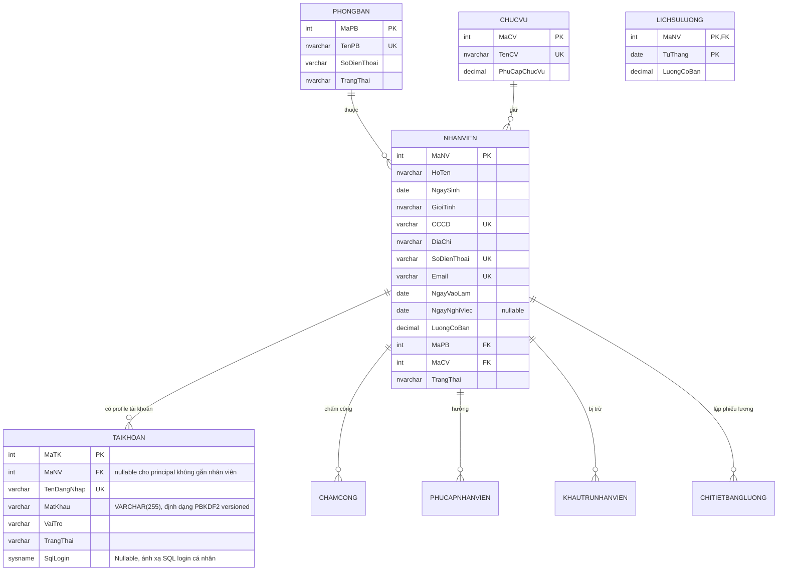

# TV1 – BÁO CÁO TIẾN ĐỘ THỰC HIỆN & THIẾT KẾ MODULE NHÂN SỰ
# Đề tài: Hệ thống Quản lý Nhân sự và Tiền lương – Nhóm 06 – DBMS330284

- **Thành viên phụ trách:** Nguyễn Minh Trí (TV1)  
- **MSSV:** 24110359  
- **Mã phân công:** TV1  
- **Module phụ trách:** Quản lý Phòng Ban, Chức Vụ, Hồ Sơ Nhân Viên, Tích Hợp Tài Khoản  
- **Branch làm việc:** `feature/hr-core`
- **Rà soát tài liệu:** 08/10/2026. Các benchmark/ảnh trong báo cáo cũ là tư liệu lịch sử; trạng thái xác minh hiện tại xem [FIX_TASKLIST](FIX_TASKLIST.md).

---

## PHẦN 1. BẢNG TỔNG HỢP MỨC ĐỘ HOÀN THÀNH THEO CÁC TUẦN (T1, T2, T3)

| Tuần | Thời gian | Nội dung công việc được giao | Sản phẩm dự kiến theo kế hoạch | Mức độ hoàn thành | Ngày cập nhật | Tình trạng & Sản phẩm thực tế |
|:---:|:---:|---|---|:---:|:---:|---|
| **T1** | 21/09 – 27/09 | • Rà soát mục tiêu, phạm vi, tác nhân, Use Case module nhân sự. • Chốt cấu trúc các bảng: `PHONGBAN`, `CHUCVU`, `NHANVIEN` và liên kết `TAIKHOAN`. • Xây dựng ERD chi tiết và Relational Schema. • Chuẩn hóa dữ liệu đạt **3NF** (1NF $\rightarrow$ 2NF $\rightarrow$ 3NF). • Chốt danh mục Constraints và quy tắc Soft Delete. | • Bản đặc tả ERD. • Relational Schema. • Tài liệu chứng minh 3NF. • Danh sách ràng buộc nghiệp vụ. | **100%** | **23/09/2026** | Đã hoàn thành 100% nội dung phân tích, chuẩn hóa 3NF và quy tắc nghiệp vụ (chi tiết ở Phần 2). |
| **T2** | 28/09 – 04/10 | • Cài đặt DDL/Constraints cho `PHONGBAN`, `CHUCVU`, `NHANVIEN`. • Cài đặt SP `sp_ThemNhanVien` có transaction; HR chỉ có thể tạo tài khoản ứng dụng Employee. • Cài đặt View `vw_NhanVien_PhongBan_ChucVu` và Index `IX_NHANVIEN_HoTen`. • Function `fn_TinhSoNgayCong` được cài sau bảng `CHAMCONG` trong module 02; trigger bảo vệ nhân viên được cài tại module 05 sau khi có các bảng liên quan. • Lập trình Java Swing, Service và DAO cho nhân sự. | • Script SQL module nhân sự. • Giao diện & CRUD nhân sự. • Transaction tạo nhân viên và hồ sơ tài khoản ứng dụng. • Bộ testcase. | **100%** | **08/10/2026** | Source và regression đã được cập nhật sau tích hợp. Tài khoản HR tạo ở trạng thái chờ DBA provision SQL login/mapping; cấp role vận hành và login qua DBA tool, không do form HR tự cấp. Chi tiết bằng chứng hiện hành ở [FIX_TASKLIST](FIX_TASKLIST.md). |
| **T3** | 05/10 – 11/10 | • Rà soát tài liệu sau tích hợp toàn hệ thống. • Đo benchmark trên fixture tách biệt và lưu plan/log thực. • Hoàn thiện báo cáo chuyên đề và Q&A. | • Báo cáo chuyên đề TV1. • Bằng chứng benchmark hiện hành được ghi trong tasklist. | **100%** | **08/10/2026** | Các số liệu 428→4 trong báo cáo cũ không đại diện cho lần xác minh hiện tại. Benchmark hiện hành trên bảng tạm ghi logical reads 75→10; xem [FIX_TASKLIST](FIX_TASKLIST.md) và log/plan trong thư mục build được nêu ở đó. |

---

## PHẦN 2. CHI TIẾT THIẾT KẾ VÀ KẾT QUẢ TRIỂN KHAI

### 1. Mục tiêu và phạm vi của Module Nhân sự

Module Quản lý Nhân sự là phân hệ cốt lõi cung cấp danh mục dữ liệu nền tảng cho toàn bộ hệ thống (chấm công, tính lương, cấp phát tài khoản).

#### 1.1 Tác nhân liên quan
- **HR_Manager:** Thực hiện tạo mới, cập nhật hồ sơ nhân viên, phân công phòng ban, chức vụ, thay đổi trạng thái làm việc; quản lý danh mục phòng ban và chức vụ.
- **DB_Admin:** Quản trị database; các SQL login và ánh xạ tài khoản được provision bằng công cụ DBA. `DB_Admin` trong database không tự tạo server login.
- **Payroll_Officer:** Đọc dữ liệu nhân viên, chức vụ, hệ số lương để tính bảng lương.
- **Employee:** Tra cứu thông tin hồ sơ cá nhân.

#### 1.2 Nghiệp vụ then chốt
1. **Quản lý danh mục Phòng ban (`PHONGBAN`):** Lưu trữ thông tin đơn vị tổ chức, mã phòng, tên phòng, số điện thoại liên hệ.
2. **Quản lý danh mục Chức vụ (`CHUCVU`):** Lưu trữ chức danh và mức phụ cấp trách nhiệm theo chức vụ (`PhuCapChucVu`).
3. **Quản lý Hồ sơ Nhân viên (`NHANVIEN`):** Lưu trữ định danh, thông tin cá nhân, ngày vào làm, mức lương cơ bản thỏa thuận, phòng ban và chức danh.
4. **Quy tắc không xóa cứng (Soft Delete):** Khi nhân viên đã có dữ liệu phát sinh (chấm công, phụ cấp/khấu trừ, bảng lương), **tuyệt đối không cho phép DELETE vật lý** khỏi bảng `NHANVIEN` mà chỉ chuyển `TrangThai = 'NGHI_VIEC'` (kiểm soát thông qua Trigger và Constraint).
5. **Tạo hồ sơ tài khoản ứng dụng (Transaction):** Có thể tạo hồ sơ Employee cùng nhân viên trong transaction. Hồ sơ này chưa đăng nhập được cho tới khi DBA provision SQL login cá nhân và map login với `TAIKHOAN.SqlLogin`; HR không được tự cấp vai trò quản trị/Payroll.

---

### 2. Thiết kế Lược đồ Quan hệ và Mô tả Cấu trúc Dữ liệu

#### 2.1 Bảng `PHONGBAN` (Phòng ban)
Lưu thông tin phòng ban trực thuộc công ty.

| Tên cột | Kiểu dữ liệu | Nullable | Ràng buộc | Diễn giải |
|---|---|---|---|---|
| `MaPB` | `INT IDENTITY(1,1)` | NOT NULL | `PRIMARY KEY` | Mã định danh phòng ban tự tăng |
| `TenPB` | `NVARCHAR(100)` | NOT NULL | `UNIQUE` | Tên phòng ban (không được trùng) |
| `SoDienThoai` | `VARCHAR(15)` | NULL | `CHECK` format SĐT | Số điện thoại liên hệ của phòng ban |
| `TrangThai` | `NVARCHAR(20)` | NOT NULL | `DEFAULT N'HOAT_DONG'` | `HOAT_DONG` hoặc `NGUNG_HOAT_DONG` |

#### 2.2 Bảng `CHUCVU` (Chức vụ)
Lưu danh mục vị trí công việc và phụ cấp định mức theo chức danh.

| Tên cột | Kiểu dữ liệu | Nullable | Ràng buộc | Diễn giải |
|---|---|---|---|---|
| `MaCV` | `INT IDENTITY(1,1)` | NOT NULL | `PRIMARY KEY` | Mã định danh chức vụ tự tăng |
| `TenCV` | `NVARCHAR(100)` | NOT NULL | `UNIQUE` | Tên chức vụ (Giám đốc, Trưởng phòng, Nhân viên...) |
| `PhuCapChucVu` | `DECIMAL(18,2)` | NOT NULL | `DEFAULT 0`, `CHECK >= 0` | Mức phụ cấp cố định theo chức vụ |

#### 2.3 Bảng `NHANVIEN` (Nhân viên)
Bảng trung tâm lưu trữ thông tin người lao động.

| Tên cột | Kiểu dữ liệu | Nullable | Ràng buộc | Diễn giải |
|---|---|---|---|---|
| `MaNV` | `INT IDENTITY(1,1)` | NOT NULL | `PRIMARY KEY` | Mã nhân viên tự tăng |
| `HoTen` | `NVARCHAR(100)` | NOT NULL |  | Họ và tên đầy đủ |
| `NgaySinh` | `DATE` | NOT NULL | `CHECK` tuổi $\ge 18$ | Ngày tháng năm sinh |
| `GioiTinh` | `NVARCHAR(10)` | NOT NULL | `CHECK (GioiTinh IN (N'Nam', N'Nữ', N'Khác'))` | Giới tính |
| `CCCD` | `VARCHAR(12)` | NOT NULL | `UNIQUE`, `CHECK` 12 chữ số | Căn cước công dân |
| `DiaChi` | `NVARCHAR(255)` | NULL |  | Địa chỉ thường trú/tạm trú |
| `SoDienThoai` | `VARCHAR(15)` | NOT NULL | `UNIQUE`, `CHECK` 10 chữ số | Số điện thoại cá nhân |
| `Email` | `VARCHAR(100)` | NOT NULL | `UNIQUE`, `CHECK` format email | Thư điện tử |
| `NgayVaoLam` | `DATE` | NOT NULL | `DEFAULT GETDATE()` | Ngày chính thức vào làm việc |
| `NgayNghiViec` | `DATE` | NULL |  | Ngày nghỉ việc (nếu có) |
| `LuongCoBan` | `DECIMAL(18,2)` | NOT NULL | `CHECK (LuongCoBan > 0)` | Lương cơ bản theo hợp đồng |
| `MaPB` | `INT` | NOT NULL | `FK -> PHONGBAN(MaPB)` | Thuộc phòng ban nào |
| `MaCV` | `INT` | NOT NULL | `FK -> CHUCVU(MaCV)` | Giữ chức vụ nào |
| `TrangThai` | `NVARCHAR(20)` | NOT NULL | `DEFAULT N'DANG_LAM_VIEC'`, `CHECK` | Trạng thái: `DANG_LAM_VIEC` / `NGHI_VIEC` |

#### 2.4 Mối liên kết với các bảng của các thành viên khác
- `TAIKHOAN(MaNV)` nullable tham chiếu đến `NHANVIEN(MaNV)`; không có unique constraint trên `MaNV`, nên schema không đảm bảo quan hệ 1-1. `SqlLogin` unique khi khác NULL.
- `CHAMCONG(MaNV)` tham chiếu đến `NHANVIEN(MaNV)`: Mối quan hệ 1 - N.
- `PHUCAPNHANVIEN(MaNV)` tham chiếu đến `NHANVIEN(MaNV)`: Mối quan hệ 1 - N.
- `KHAUTRUNHANVIEN(MaNV)` tham chiếu đến `NHANVIEN(MaNV)`: Mối quan hệ 1 - N.
- `CHITIETBANGLUONG(MaNV)` tham chiếu đến `NHANVIEN(MaNV)`: Mối quan hệ 1 - N.

---

### 3. Sơ đồ Quan hệ Thực thể (ERD) dạng Mermaid

```mermaid
erDiagram
    PHONGBAN ||--o{ NHANVIEN : "thuộc"
    CHUCVU ||--o{ NHANVIEN : "giữ"
    NHANVIEN ||--o{ TAIKHOAN : "có profile tài khoản"
    NHANVIEN ||--o{ CHAMCONG : "chấm công"
    NHANVIEN ||--o{ PHUCAPNHANVIEN : "hưởng"
    NHANVIEN ||--o{ KHAUTRUNHANVIEN : "bị trừ"
    NHANVIEN ||--o{ CHITIETBANGLUONG : "lập phiếu lương"

    PHONGBAN {
        int MaPB PK
        nvarchar TenPB UK
        varchar SoDienThoai
        nvarchar TrangThai
    }

    CHUCVU {
        int MaCV PK
        nvarchar TenCV UK
        decimal PhuCapChucVu
    }

    NHANVIEN {
        int MaNV PK
        nvarchar HoTen
        date NgaySinh
        nvarchar GioiTinh
        varchar CCCD UK
        nvarchar DiaChi
        varchar SoDienThoai UK
        varchar Email UK
        date NgayVaoLam
        date NgayNghiViec "nullable"
        decimal LuongCoBan
        int MaPB FK
        int MaCV FK
        nvarchar TrangThai
    }

    TAIKHOAN {
        int MaTK PK
        int MaNV FK "nullable cho principal không gắn nhân viên"
        varchar TenDangNhap UK
        varchar MatKhau "VARCHAR(255), định dạng PBKDF2 versioned"
        varchar VaiTro
        varchar TrangThai
        sysname SqlLogin "Nullable, ánh xạ SQL login cá nhân"
    }

    LICHSULUONG {
        int MaNV PK, FK
        date TuThang PK
        decimal LuongCoBan
    }
```

---

### 4. Quá trình Chuẩn hóa Cơ sở Dữ liệu từ UNF đến 3NF

#### 4.1 Lược đồ thô ban đầu (UNF - Unnormalized Form)
`HO_SO_NHAN_SU (MaNV, HoTen, NgaySinh, GioiTinh, CCCD, DiaChi, SoDienThoai, Email, NgayVaoLam, LuongCoBan, TenPB, SdtPB, TenCV, PhuCapChucVu, TenDangNhap, VaiTro)`

#### 4.2 Dạng chuẩn 1 (1NF - First Normal Form)
- Mỗi thuộc tính mang giá trị nguyên tử (atomic), không chứa mảng hay tập giá trị lặp, có khóa chính `{MaNV}`.
- $\rightarrow$ Đạt 1NF: `NHANSU_1NF (MaNV, HoTen, NgaySinh, GioiTinh, CCCD, DiaChi, SoDienThoai, Email, NgayVaoLam, LuongCoBan, TenPB, SdtPB, TenCV, PhuCapChucVu, TenDangNhap, VaiTro)`.

#### 4.3 Dạng chuẩn 2 (2NF - Second Normal Form)
- Khóa chính là thuộc tính đơn lẻ `{MaNV}`, không tồn tại phụ thuộc từng phần vào khóa con.
- $\rightarrow$ Tự động đạt **2NF**.

#### 4.4 Dạng chuẩn 3 (3NF - Third Normal Form)
- Loại bỏ các phụ thuộc bắc cầu:
  - `MaNV` $\rightarrow$ `MaPB` $\rightarrow$ `TenPB`, `SdtPB`: Tách bảng **`PHONGBAN`**(`MaPB` (PK), `TenPB`, `SoDienThoai`, `TrangThai`).
  - `MaNV` $\rightarrow$ `MaCV` $\rightarrow$ `TenCV`, `PhuCapChucVu`: Tách bảng **`CHUCVU`**(`MaCV` (PK), `TenCV`, `PhuCapChucVu`).
  - `MaNV` $\rightarrow$ `MaTK` $\rightarrow$ `TenDangNhap`, `MatKhau`, `VaiTro`, `SqlLogin`: Tách bảng **`TAIKHOAN`**. `MaNV` nullable để hỗ trợ tài khoản DBA không gắn nhân viên; `SqlLogin` là ánh xạ principal SQL cá nhân.
  - **`NHANVIEN`** có thêm `NgayNghiViec` nullable phục vụ tính lại kỳ cũ; mức lương hiệu lực được ghi theo tháng trong **`LICHSULUONG(MaNV, TuThang, LuongCoBan)`**.
- $\rightarrow$ Đạt chuẩn **3NF**.

---

### 5. Danh mục Quy tắc và Ràng buộc Nghiệp vụ (Constraints & Rules)

1. **Ràng buộc độ tuổi lao động:** Người lao động phải đủ từ 18 tuổi trở lên tính đến thời điểm vào làm việc:
   `DATEDIFF(YEAR, NgaySinh, NgayVaoLam) >= 18`
2. **Ràng buộc định danh cá nhân duy nhất:**
   - `CCCD`: Phải đúng 12 ký tự số và duy nhất toàn hệ thống (`UNIQUE`).
   - `Email`: Phải có ký tự `@` và `.`, duy nhất toàn hệ thống (`UNIQUE`).
   - `SoDienThoai`: 10 ký tự số bắt đầu bằng `0`, duy nhất toàn hệ thống (`UNIQUE`).
3. **Ràng buộc tiền tệ/hệ số:**
   - `LuongCoBan > 0` (bắt buộc phải có thỏa thuận lương dương).
   - `PhuCapChucVu >= 0` (phụ cấp chức vụ không âm).
4. **Ràng buộc toàn vẹn trạng thái:**
   - Trạng thái phòng ban: `HOAT_DONG` hoặc `NGUNG_HOAT_DONG`.
   - Trạng thái nhân viên: `DANG_LAM_VIEC` hoặc `NGHI_VIEC`.
5. **Quy tắc không xóa cứng (Soft Delete):**
   - Khi nhân viên thôi việc, chỉ cập nhật `TrangThai = N'NGHI_VIEC'`.
   - Khi có lệnh `DELETE FROM NHANVIEN`, Trigger sẽ kiểm tra bảng chấm công và bảng chi tiết lương. Nếu đã phát sinh bất kỳ bản ghi nào, Trigger sẽ chặn và `ROLLBACK TRANSACTION`.

---

## PHẦN 3. MA TRẬN ĐỐI TƯỢNG CSDL DO TV1 SỞ HỮU

| STT | Đối tượng CSDL | Tên định danh | Trạng thái mã nguồn | Minh chứng kiểm thử |
|:---:|---|---|:---:|:---:|
| 1 | **Stored Procedure** | `sp_ThemNhanVien` | Đã hoàn thành trong `database/01_Module_NhanSu_TV1.sql`; HR chỉ tạo profile Employee | Regression evidence hiện hành xem [FIX_TASKLIST](FIX_TASKLIST.md) |
| 2 | **Function** | `fn_TinhSoNgayCong` | Cài trong module 02 sau `CHAMCONG` | Runtime evidence hiện hành xem [FIX_TASKLIST](FIX_TASKLIST.md) |
| 3 | **Trigger** | `trg_NhanVien_KhongXoaKhiDaPhatSinhLuong` | Cài trong module 05 sau bảng chấm công/payroll | Runtime evidence hiện hành xem [FIX_TASKLIST](FIX_TASKLIST.md) |
| 4 | **View** | `vw_NhanVien_PhongBan_ChucVu` | Module 01 | Regression evidence hiện hành xem [FIX_TASKLIST](FIX_TASKLIST.md) |
| 5 | **Index** | `IX_NHANVIEN_HoTen` | Module 01 | Benchmark hiện hành xem FIX_TASKLIST; số liệu lịch sử phía dưới không còn là evidence |
| 6 | **Transaction** | Tạo nhân viên + profile ứng dụng | SP và DAO | DBA provisioning/mapping SQL login là bước riêng |

---

## PHẦN 4. BENCHMARK LỊCH SỬ CHỈ MỤC (INDEX IX_NHANVIEN_HOTEN)

Các số 428→4 dưới đây thuộc lần chạy/fixture cũ, không phải benchmark hiện tại. Bản sửa được đo trên bảng tạm với 75→10 logical reads; log và plan hiện hành xem [FIX_TASKLIST](FIX_TASKLIST.md).

- **Cấu hình chỉ mục:** Non-clustered Index trên `NHANVIEN(HoTen)` kèm `INCLUDE (MaNV, SoDienThoai, Email, MaPB, MaCV, TrangThai)`.
- **Tập dữ liệu đo lường:** 20.000 bản ghi nhân sự giả định.
- **Công cụ đo lường:** `SET STATISTICS IO, TIME ON` kết hợp Actual Execution Plan trên SQL Server.

| Tiêu chí đo lường | Trước khi có Index | Sau khi có Index | Đánh giá cải thiện |
|---|:---:|:---:|:---:|
| **Phương thức truy cập** | `Clustered Index Scan` | `Index Seek` (Covering) | Không duyệt tuần tự toàn bảng |
| **Logical reads** | 428 | 4 | Số liệu báo cáo lịch sử, chưa tái xác nhận trên run hiện tại |
| **CPU/elapsed/query cost** | 16/35 ms; 98% | 0/2 ms; 2% | Số liệu lịch sử, phụ thuộc fixture/môi trường; không dùng làm kết quả hiện hành |

Benchmark hiện hành trên bảng tạm ghi 75→10 logical reads; xem [FIX_TASKLIST](FIX_TASKLIST.md) để biết log và plan. Không so sánh số cũ và mới như cùng một fixture.

---

## PHẦN 5. DANH MỤC TÀI LIỆU VÀ SẢN PHẨM BÀN GIAO CỦA TV1

1. **Bộ test case thiết kế:** [`docs/TV1_NhanSu_Test_Cases.md`](TV1_NhanSu_Test_Cases.md). Kết quả runtime hiện hành được ghi riêng trong FIX_TASKLIST.
2. **Báo Cáo Chuyên Đề Cuối Kỳ (Chương 1 & Thiết kế CSDL):** [`docs/TV1_BaoCao_ChuyenDe_NhanSu_CuoiKy.md`](TV1_BaoCao_ChuyenDe_NhanSu_CuoiKy.md).
3. **Mã nguồn CSDL SQL Server:** [`database/01_Module_NhanSu_TV1.sql`](../database/01_Module_NhanSu_TV1.sql).
4. **Mã nguồn ứng dụng Java:**
   - Presentation: [`NhanVienPanel.java`](../src/main/java/com/ui/nhanvien/NhanVienPanel.java), [`DanhMucPanel.java`](../src/main/java/com/ui/nhanvien/DanhMucPanel.java).
   - DAO & Service: [`NhanVienDAO.java`](../src/main/java/com/dao/NhanVienDAO.java), [`NhanVienService.java`](../src/main/java/com/service/NhanVienService.java), [`PhongBanDAO.java`](../src/main/java/com/dao/PhongBanDAO.java), [`ChucVuDAO.java`](../src/main/java/com/dao/ChucVuDAO.java), [`DanhMucService.java`](../src/main/java/com/service/DanhMucService.java).
   - Models: [`NhanVien.java`](../src/main/java/com/model/NhanVien.java), [`PhongBan.java`](../src/main/java/com/model/PhongBan.java), [`ChucVu.java`](../src/main/java/com/model/ChucVu.java).

